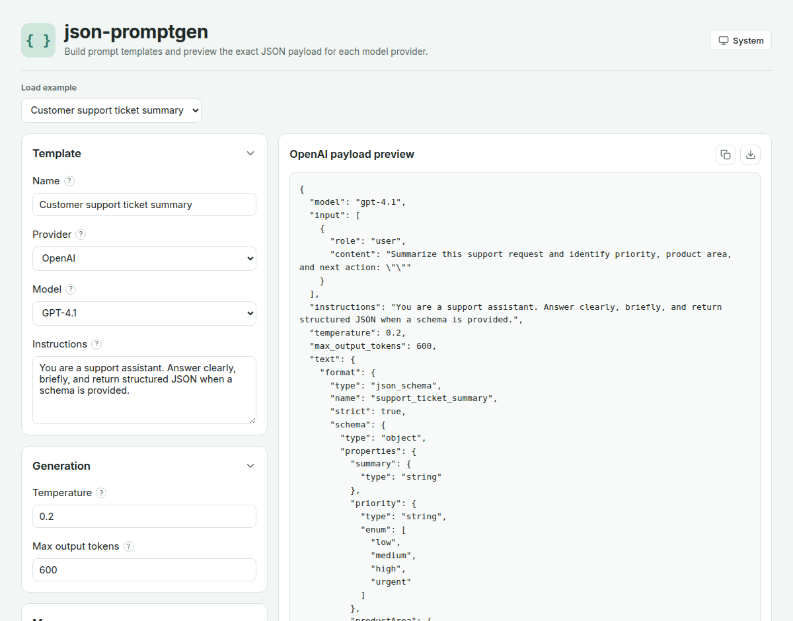
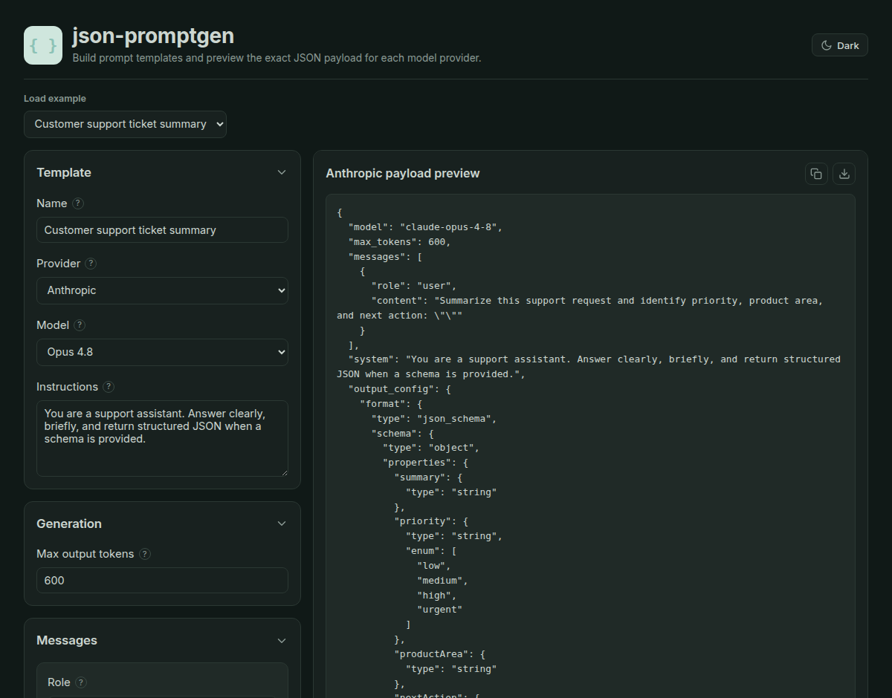

# json-promptgen

Build a prompt template once and preview the **exact JSON request payload** for each model
provider — OpenAI, Anthropic, and Google Gemini. It runs entirely in the browser: no backend,
no API keys, no network calls. You author a provider-neutral template and the app translates it
into each provider's real request shape, which you can copy or download.



<p align="center"><em>The same template rendered for Anthropic, in dark theme — note the extracted
<code>system</code> field, <code>output_config.format</code>, and that Temperature is hidden because
Opus 4.8 doesn't accept it.</em></p>



## Features

- **Multi-provider output** — one canonical template renders to OpenAI (Responses API),
  Anthropic (Messages API), and Gemini (`generateContent`) shapes.
- **Per-model awareness** — model catalogs carry capabilities, so the editor hides the
  Temperature field and omits it from the payload for models that reject it, gates structured
  output to models that support it, and caps `max output tokens` per model.
- **Provider-correct translation** — system prompts, role names, and structured-output formats
  are mapped per provider (e.g. a `developer` message folds into Anthropic's top-level `system`;
  Gemini's assistant role becomes `model`).
- **Structured output** — define a JSON Schema and see it embedded the right way for each
  provider (`text.format`, `output_config.format`, or `responseSchema`).
- **Message editor** — reorder messages by drag-and-drop or keyboard, with per-provider role
  options and shape validation (e.g. Anthropic/Gemini must start with a user turn).
- **Template variables** — `{{ placeholders }}` in message and instruction text.
- **Save & load** — export the editable template to a `.json` file and import it back later (see
  [Saving & loading templates](#saving--loading-templates)).
- **Ready-made examples**, a live **payload preview**, **copy** and **download** actions, and a
  theme-aware UI (light / dark / system) with a matching favicon.
- **Static & portable** — builds to plain HTML/CSS/JS; host it anywhere.

## How it works

```
Editor form  ──▶  CanonicalPromptTemplate  ──▶  Provider adapter  ──▶  Provider JSON payload
(provider-neutral)     (neutral shape)         (openai/anthropic/gemini)   (live preview)
```

The canonical template is provider-neutral. Each **adapter** owns the translation to one
provider's API, plus that provider's model catalog, allowed roles, and message constraints.
Adding a provider or model touches only the adapter layer — the editor and templates never change.

## Saving & loading templates

There are **two** different JSON files, and it helps to know which is which:

- **Payload JSON** — the *Download* icon in the preview panel. This is the provider-specific
  request body (`text.format`, `output_config`, `contents`…). It's **output**: paste it into your
  own backend/SDK to run the request. It's provider-specific and not meant to be re-imported.
- **Template JSON** — the *Export template* button. This is the **editable template itself** (name,
  provider, model, messages, structured-output config) — the source you were editing, and it
  round-trips.

Use **Export template** to save your work and **Import template…** (top toolbar) to load it back —
handy for sharing a template with a teammate or keeping templates in version control. Exported
files use a small versioned envelope so imports can be validated:

```json
{ "app": "json-promptgen", "version": 1, "template": { "...": "the editor state" } }
```

On import, an unknown provider falls back to the default and message roles are coerced to what the
selected provider supports (the same way examples load). Files that aren't valid json-promptgen
templates are rejected with an inline message instead of crashing.

## Providers & models

| Provider | API | Models in catalog |
|---|---|---|
| OpenAI | Responses (`client.responses.create`) | GPT-4.1, GPT-4o |
| Anthropic | Messages (`client.messages.create`) | Opus 4.8, Sonnet 5, Fable 5, Haiku 4.5 |
| Google | Gemini (`generateContent`) | Gemini 2.5 Pro, Gemini 2.5 Flash |

The model list is a **hand-maintained static catalog** (a keyless browser app can't query provider
APIs). Any model not listed can still be used via the **Custom…** option in the Model dropdown.
Model capability data is set at a model's launch and rarely changes, so keeping it current is
mostly a matter of adding rows for new models.

## Getting started

**Prerequisites:** Node `^20.19.0 || >=22.12.0`.

```sh
npm install       # install dependencies
npm run dev       # start the dev server with hot reload
```

Then open the printed local URL.

### Scripts

| Script | What it does |
|---|---|
| `npm run dev` | Vite dev server with HMR |
| `npm run build` | Type-check + production build to `dist/` |
| `npm run preview` | Serve the production build locally |
| `npm run type-check` | `vue-tsc` type checking |
| `npm run lint` | oxlint + ESLint (with `--fix`) |
| `npm run format` | Prettier over `src/` |
| `npm run test:unit` | Run the Vitest unit tests |

## Testing

Unit tests run with [Vitest](https://vitest.dev/):

```sh
npm run test:unit    # run once
npx vitest           # watch mode
```

Coverage targets the logic that matters rather than the framework:

- **Adapters** (`src/adapters/__tests__`) — payload translation for each provider (system
  extraction, role mapping, per-model temperature/structured-output gating), plus `interpolate`,
  `resolveModel`, and message-shape validation.
- **Editor composable** (`src/composables/__tests__`) — canonical-template derivation, provider
  switching (model swap + role coercion), the export → import round-trip, and schema validation.
- **Template file** (`src/lib/__tests__`) — the save-file envelope and its parser.

The adapter and file-format suites are pure functions; the composable suite declares
`// @vitest-environment node` per file so `crypto.randomUUID()` (used for message ids) is available.

## Project structure

```
src/
  adapters/        Provider adapters + registry (openai, anthropic, gemini),
                   the PromptAdapter/ModelSpec types, model resolver, validation
  components/      Editor UI (form, collapsible panels, field hints, theme toggle)
  composables/     Editor state (usePromptTemplateEditor), theme (useTheme)
  examples/        Ready-made canonical templates shown in "Load example"
  lib/             Template save-file format (export/import envelope + parser)
  types/           CanonicalPromptTemplate + shared prompt types
  views/           The editor page
```

Tests live alongside the code they cover, in `__tests__/` directories.

## Extending

**Add a model to a provider** — add one row to that adapter's `models: ModelSpec[]`:

```ts
{ id: 'gpt-4.1-mini', label: 'GPT-4.1 mini', supportsTemperature: true,
  supportsStructuredOutput: true, maxOutputTokens: 16384 }
```

**Add an example** — create a `CanonicalPromptTemplate` in `src/examples/` and register it in
`src/examples/index.ts`.

**Add a provider** — implement the `PromptAdapter` interface in `src/adapters/<name>.ts`
(`id`, `label`, `supportedRoles`, `models`, `defaultModel`, optional `messageConstraints`, and a
`toPayload()` that maps the canonical template to the provider's request body), then register it in
`src/adapters/index.ts`. No changes to the editor or canonical schema are needed.

## Deployment

The build is a static SPA — host `dist/` on any static host (Netlify, GitHub Pages, S3, nginx, …).

- **Root path:** `npm run build` (default `base` is `/`).
- **Subpath:** `BASE_PATH=/promptgen/ npm run build` — asset, router, and favicon paths follow the
  base automatically.
- **Deep links:** the app currently has a single route, so a server rewrite is optional; if you
  add routes and can't configure the host, switch the router to `createWebHashHistory()`.

## Notes

- This tool **generates request payloads** — it does not call any provider API, so no keys are
  required or handled. Paste the copied JSON into your own backend/SDK to actually run it.
- Some models reject fields the tool models generically (e.g. current Claude models reject
  `temperature`); the per-model capability flags handle the common cases, and the **Custom…**
  model option assumes a permissive profile.

## Tech stack

Vue 3 · Vite · TypeScript · Vue Router · Pinia · Inter (Google Fonts).

## License

No license yet — add a `LICENSE` file (e.g. MIT) before relying on this publicly.
